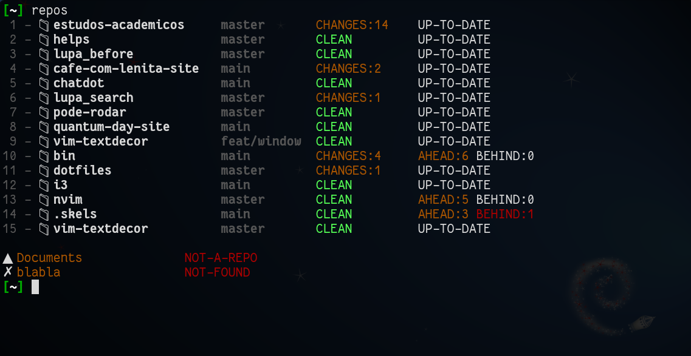
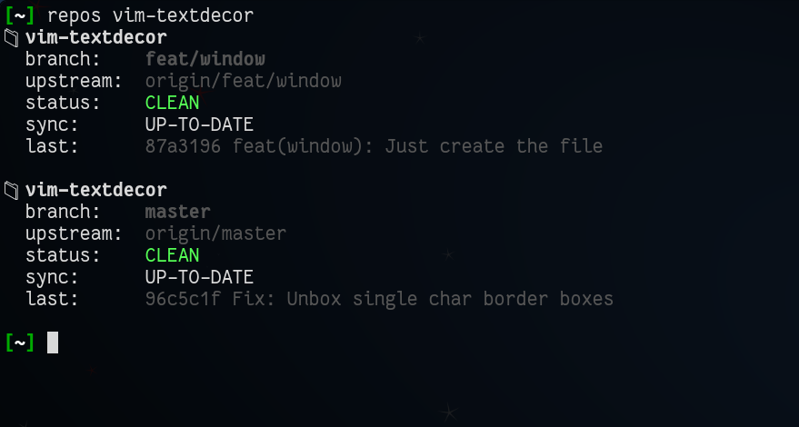
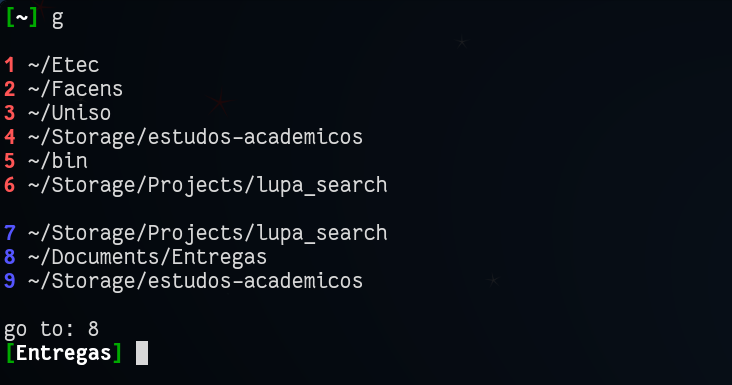

# My Terminal Utils

```text
 __  __         _____                   _             _   _   _ _   _ _
|  \/  |_   _  |_   _|__ _ __ _ __ ___ (_)_ __   __ _| | | | | | |_(_) |___
| |\/| | | | |   | |/ _ \ '__| '_ ` _ \| | '_ \ / _` | | | | | | __| | / __|
| |  | | |_| |   | |  __/ |  | | | | | | | | | | (_| | | | |_| | |_| | \__ \
|_|  |_|\__, |   |_|\___|_|  |_| |_| |_|_|_| |_|\__,_|_|  \___/ \__|_|_|___/
        |___/
```


Personal command-line scripts I use to make everyday terminal work faster.

Mostly small Bash/Zsh utilities, collected here so they can be reused, changed, or moved between machines.

## Scripts

| Script            | Purpose                                            |
| ----------------- | -------------------------------------------------- |
| `bk`              | Create a timestamped backup of a file or directory |
| `clear-texfolder` | Remove LaTeX auxiliary files                       |
| `clip-menu`       | Start `clipmenu` using `rofi`                      |
| `decompress`      | Extract `.rar` and `.zip` files recursively        |
| `efind`           | Friendlier wrapper around `find`                   |
| `g`               | Jump to saved or recent directories                |
| `lt`              | Tree view with sensible defaults                   |
| `mkdirbylist`     | Create folders from a text list                    |
| `repos`           | Show status for multiple Git repositories          |
| `send-to-termbin` | Send a file to termbin                             |
| `show-md`         | Render a Markdown file as HTML                     |

## Usage

Clone the repository and add it to your `PATH`, or copy the scripts you want to use.
=======
Small scripts I use in my terminal.

This is not a framework, package, or polished CLI suite.
It is just my personal toolbox.

## Tools

### `repos`

Shows the status of multiple Git repositories at once.

Useful when I want to quickly check which projects have local changes, commits ahead/behind, or no upstream configured.

```bash
repos
repos -d
repos -v
repos chatdot
```

Screenshot:




---

### `g`

Small directory jumper.

It mixes saved paths from `~/.dirs_stack` with recent shell directories and lets me choose where to go.

```bash
g
g a ~/projects/my-repo
g r
g o
```

Note: the script prints the selected path. I usually use it through a shell function that performs the actual `cd`.





---

### `clip-menu`

Tiny wrapper for `clipmenu` using `rofi`.

```bash
clip-menu
```

Screenshot:

```markdown

```

---

### `lt`

A simpler `tree`.

By default, it shows two levels and respects `.gitignore` when available.

```bash
lt
lt 3
```

Screenshot:

```markdown

```

---

### `bk`

Creates a backup copy of a file or directory.

```bash
bk notes.txt
bk my-folder
```

---

### `show-md`

Renders a Markdown file as HTML.

```bash
show-md README.md
```

## Other scripts

| Script            | Purpose                              |
| ----------------- | ------------------------------------ |
| `clear-texfolder` | Remove LaTeX auxiliary files         |
| `decompress`      | Extract compressed files recursively |
| `efind`           | Friendlier wrapper around `find`     |
| `mkdirbylist`     | Create folders from a list           |
| `send-to-termbin` | Send a file to termbin               |

## Screenshots

I keep README images in:

```text
docs/screenshots/
```

Example:

```text
docs/
└── screenshots/
    ├── repos.png
    ├── g.png
    ├── clip-menu.png
    └── lt.png
```

## Usage

Clone the repository:
>>>>>>> 361a05e (chore(README): Add screenshots for some tools)

```bash
git clone https://github.com/ovidio-francisco/my-terminal-utils.git
```

<<<<<<< HEAD
Example:

```bash
./bk notes.txt
./lt 3
./repos -d
=======
Add it to your `PATH`, or copy only the scripts you want.

Example:

```bash
export PATH="$HOME/path/to/my-terminal-utils:$PATH"
>>>>>>> 361a05e (chore(README): Add screenshots for some tools)
```

## Notes

<<<<<<< HEAD
These scripts are personal utilities, not polished CLI tools.

Read each script before running it, especially the ones that remove files.

=======
These scripts were written for my own workflow.

Some of them assume tools such as `git`, `tree`, `rofi`, `clipmenu`, or `termbin` are installed.

Read the script before running it, especially scripts that remove or move files.

## Author

Ovídio José Francisco
